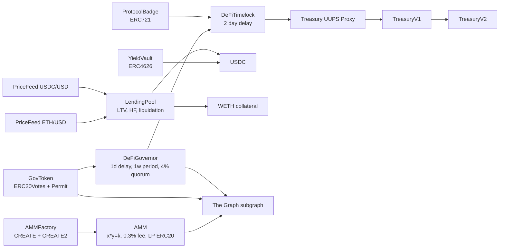
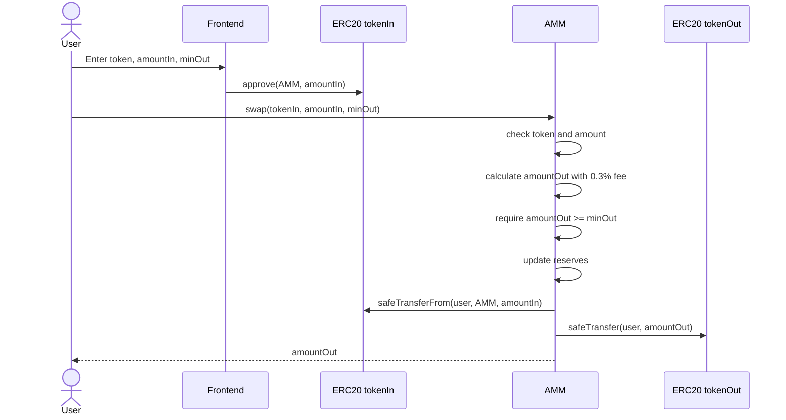
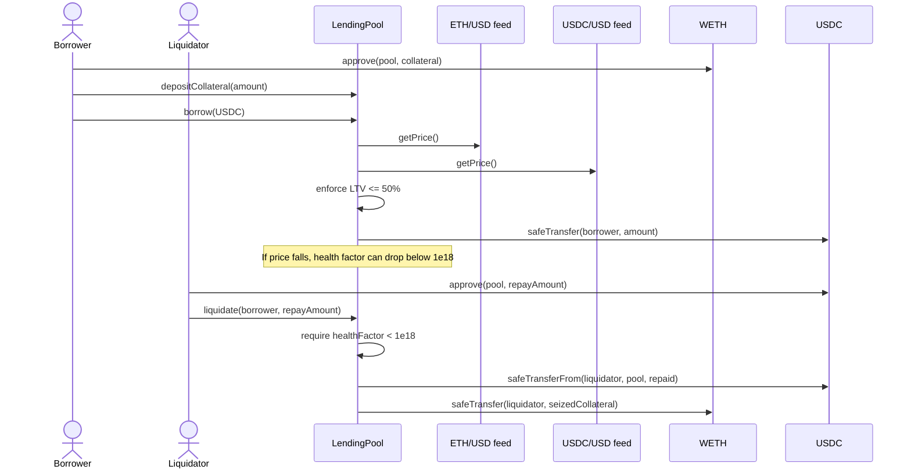
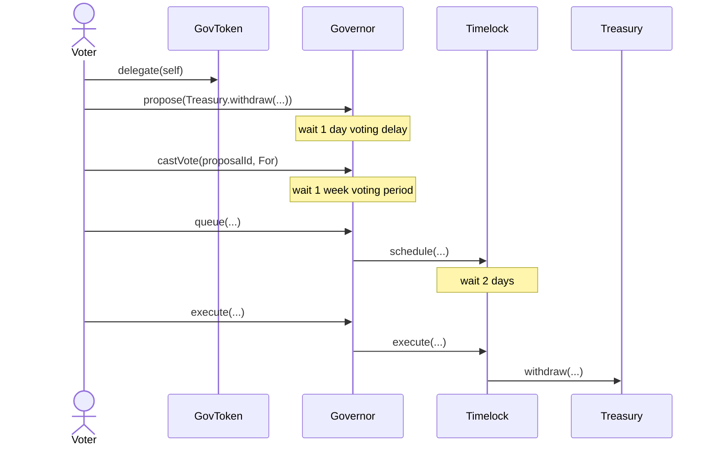
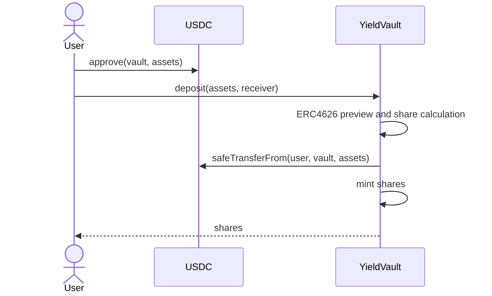

# Architecture Document - DeFi Super-App

## 1. Scope

The protocol implements the DeFi Super-App scenario: an AMM, lending pool, tokenized yield vault, oracle adapter, governance stack, indexing layer, frontend, deployment scripts, and internal security documentation. The design favors small auditable contracts over a monolithic protocol. Each component has a narrow responsibility, and cross-component authority is concentrated in the Timelock so upgrades and treasury actions pass through governance.

## 2. System Context

```mermaid
flowchart LR
  user["User\nTrader, LP, lender, voter"]
  frontend["React dApp\nWallet UI"]
  protocol["Arbitrum Sepolia Contracts\nAMM, lending, vault, DAO"]
  chainlink["Chainlink\nETH/USD and USDC/USD feeds"]
  graph["The Graph\nIndexed swaps, proposals, votes"]
  explorer["Arbiscan\nVerification"]
  user --> frontend
  frontend --> protocol
  frontend --> graph
  protocol --> chainlink
  protocol --> explorer
```

## 3. Component Architecture



The `AMM` is built from scratch. LP shares are the AMM contract's ERC20 token. The `LendingPool` is also built from scratch and uses Chainlink-backed value calculations, LTV checks, health factor accounting, liquidation bonus logic, and linear debt accrual. `YieldVault` relies on OpenZeppelin ERC4626 for standards compliance while wrapping state-changing entry points in `ReentrancyGuard`.

## 4. Critical Flows

### 4.1 AMM Swap



The AMM follows Checks-Effects-Interactions and uses `SafeERC20`. Slippage is enforced through `minAmountOut`.

### 4.2 Lending Borrow And Liquidation



The pool values collateral and debt in 18-decimal USD terms. It supports mixed token decimals through `IERC20Metadata.decimals()`.

### 4.3 Governance Lifecycle



This full lifecycle is covered by `test_FullLifecycle_QueueAndExecuteTreasuryWithdraw`.

### 4.4 Vault Deposit



The vault supports standard ERC4626 `deposit`, `withdraw`, and `redeem`, plus owner-controlled `depositYield`.

## 5. Storage Layout

### GovToken

OpenZeppelin ERC20, ERC20Permit, ERC20Votes and Ownable storage. The project contract itself adds no custom storage variables.

### ProtocolBadge

| Slot | Variable | Type |
|---|---|---|
| OZ | ERC721 / ERC721URIStorage state | inherited |
| OZ | Ownable owner | inherited |
| custom | `_nextTokenId` | `uint256` |

### AMM

| Variable | Type | Purpose |
|---|---|---|
| `tokenA` | `IERC20 immutable` | First pool token |
| `tokenB` | `IERC20 immutable` | Second pool token |
| `reserveA` | `uint256` | Accounting reserve for token A |
| `reserveB` | `uint256` | Accounting reserve for token B |
| inherited ERC20 | multiple | LP token balances and allowances |

### LendingPool

| Variable | Type | Purpose |
|---|---|---|
| `collateralToken` | `IERC20 immutable` | Collateral asset |
| `debtToken` | `IERC20 immutable` | Borrowed asset |
| `collateralPriceFeed` | `ILendingPriceFeed immutable` | Collateral oracle |
| `debtPriceFeed` | `ILendingPriceFeed immutable` | Debt oracle |
| `collateralBalance` | `mapping(address => uint256)` | User collateral |
| `debtPrincipal` | `mapping(address => uint256)` | Accrued user debt |
| `lastAccruedAt` | `mapping(address => uint256)` | Interest checkpoint |

### Treasury UUPS Layout

| Slot group | TreasuryV1 | TreasuryV2 |
|---|---|---|
| inherited | UUPS / Initializable / OwnableUpgradeable state | unchanged |
| custom | `balances: mapping(address => uint256)` | unchanged |
| custom | `_locked: bool` | unchanged |
| appended | - | `paused: bool` |

TreasuryV2 only appends `paused`; it does not reorder or remove V1 state. This prevents storage collision in the V1 to V2 upgrade path.

### YieldVault

| Variable | Type | Purpose |
|---|---|---|
| inherited ERC4626 | inherited | Asset, share accounting, ERC20 share balances |
| inherited Ownable | inherited | Yield depositor authority |
| `totalYieldDistributed` | `uint256` | Cumulative externally added yield |

### PriceFeed

| Variable | Type | Purpose |
|---|---|---|
| `feed` | `AggregatorV3Interface immutable` | Chainlink aggregator |
| `stalenessThreshold` | `uint256 immutable` | Maximum price age |

### AMMFactory

| Variable | Type | Purpose |
|---|---|---|
| `allPools` | `address[]` | Pool registry |
| `getPool` | `mapping(address => mapping(address => address))` | Token pair lookup |

## 6. Access Control

| Functionality | Authority |
|---|---|
| GovToken minting after deployment | Timelock |
| Treasury withdrawals | Timelock |
| Treasury upgrades | Timelock |
| Treasury pause/unpause in V2 | Timelock |
| ProtocolBadge minting | Timelock |
| YieldVault yield injection | Timelock |
| Timelock proposal scheduling | Governor only |
| AMM, lending, vault user flows | Permissionless |

The deploy script grants Governor proposer/canceller roles, revokes deployer proposer/admin roles, and transfers GovToken ownership to the Timelock.

## 7. Design Patterns

| Pattern | Usage | Justification |
|---|---|---|
| Factory | `AMMFactory` | Enables regular and deterministic pool deployment |
| UUPS proxy | `TreasuryV1 -> TreasuryV2` | Demonstrates upgrade path while preserving treasury address |
| Checks-Effects-Interactions | AMM, Treasury, LendingPool | State is updated before token transfers |
| SafeERC20 | AMM, Treasury, Vault, LendingPool | Handles non-standard ERC20 return behavior |
| ReentrancyGuard | AMM, Vault, LendingPool | Protects external token-transfer flows |
| Timelock | Governance stack | Delays sensitive actions by 2 days |
| Oracle adapter | `PriceFeed` | Isolates Chainlink staleness and round checks |
| State machine | Governor proposal states | Proposal lifecycle is explicit and test-covered |

## 8. Trust Assumptions

Chainlink feeds are trusted for price discovery. The adapter rejects stale, negative, zero, and incomplete rounds. The Timelock is trusted as the protocol's administrative choke point. If governance is captured, treasury assets and upgrade authority can be abused after the 2-day delay. The frontend is not trusted for enforcement; all critical checks live in contracts. The subgraph is an indexing aid, not a source of truth. Users must still verify proposal state and transaction details on-chain.

If the deployer key is compromised after the hardened deploy script completes, the deployer should not retain Timelock admin or proposer authority. If it is compromised before deployment finalization, the attacker can deploy malicious parameters, so post-deployment verification is mandatory.

## 9. ADRs

### ADR-001: UUPS Treasury

Context: the assignment requires an upgradeable contract and V1 to V2 path. Decision: use OpenZeppelin UUPS. Consequence: `_authorizeUpgrade` must be owner-gated, and owner is set to Timelock.

### ADR-002: Constant Product AMM

Context: AMM must be implemented from scratch. Decision: x*y=k with 0.3% fee and LP ERC20. Consequence: less capital efficient than concentrated liquidity, but easier to audit and test.

### ADR-003: Lending Pool Valuation

Context: Option A needs lending behavior. Decision: single collateral token and debt token with Chainlink value conversion, fixed 50% LTV, 75% liquidation threshold, and 5% APR linear interest. Consequence: simple enough for audit while still demonstrating core lending mechanics.

### ADR-004: OpenZeppelin Governor

Context: governance requirements match the OZ Governor stack. Decision: use Governor, GovernorSettings, GovernorVotes, GovernorVotesQuorumFraction, and GovernorTimelockControl. Consequence: proposal logic is battle-tested; tests focus on parameter correctness and end-to-end lifecycle.

### ADR-005: Subgraph As Read Model

Context: frontend needs indexed protocol data. Decision: subgraph indexes AMM, token, and governance events. Consequence: proposal list comes from The Graph, while live proposal state can still be checked against Governor.
